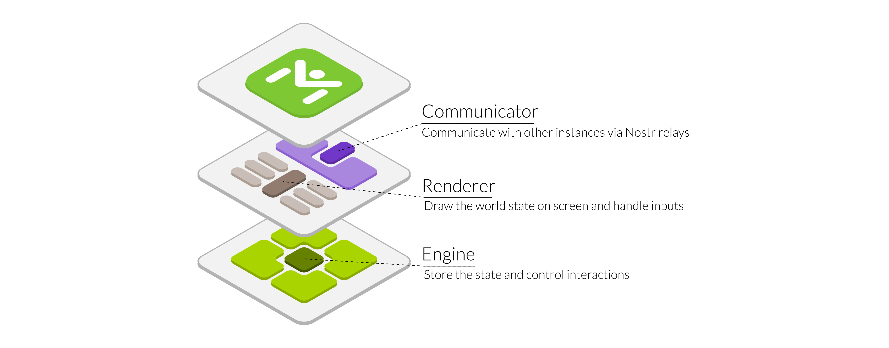
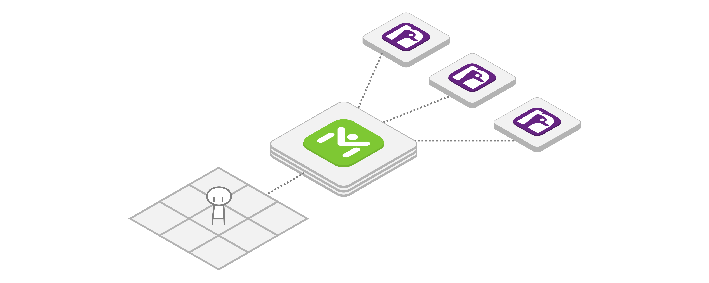

Meetstr
=======

A new way to meetup, decentralized

Introduction
------------

A digital world where you can meet and chat with anyone you want, wherever you are.

This project aim to be a framework that allow Meetstr to be extended and build upon.

🧩 Meetstr components
--------------------

Meetstr is divided in three parts:

- **Engine:** The main rules are contained and controlled with a structured interface, this is the "brain" of the system

- **Renderer:** The implementation that generate an audio and visual representation of the state managed by the Engine and take care of sending inputs to it, this component is the "eyes" and "hands" of the Meetstr

- **Communicator:** This is the "speaker" and "listener" that talk with the Nostr relays, by keeping it separated from the engine it is easier to expand and adapt without having to rely on specific dependencies.

As we can see, these three components have a clear role, and they can be swapped freely, this allows them to create unique combinations.

📜 Rules of Meetstr
------------------

To have a working system that is accessible for every person and hardware some assumptions where made:

- **The world is a grid**  
  Using a tile-based layout simplifies implementations and extension while keeping the system light for relays. A developer can hide the grid by smoothing it out, having free motion that snaps to the grid or clearly showing the grid, like a chessboard.

- **A character stays on one tile only**  
  No matter the visual size, a character only occupies a single tile, this allows for easier interpretation between systems for movement and interactions.

- **The world must be collapsible/flat**  
  To let possible 2D and 3D implementations work together they should be on the same logical level. Imagine shaking hands with a friend positioned in front of you, but on another floor... height differences should be supported for more interesting locations, but they should be used just for visual representation, the best examples are solid stairs without free passage below them or terrains with slopes.

- **A generic character must be provided**  
  To have a proper onboarding for new users, any implementation must provide a generic character for any new user that joins, so they have a visual representation of themselves within the world, potentially pre-branded with the user info, they can then customize it freely at a later time.

- **Common interactions**  
  To have a compatible system there should be a set of common rules for defining the world and characters, so they can be represented in any world correctly.

🎭 Creativity unleashed
----------------------

While the rules ensure uniformity, the system should take into consideration how to allow creators of any kind to craft their own content and share it with the world.

- **The visuals are entirely decoupled**  
  The core system is just a grid, that means the visual content can be in any style and dimension you like. Be it 2D, 3D, 2.5D, Isometric, 360 VR, Audio-only, wall of emojis, ASCII in a terminal, anything goes as long as it fits a grid.

- **Crafting worlds**  
  The worlds users can visit are created by the users themselves, many little places, all connected. Build your dream house, a dangerous dungeon or a cozy forest anyone can explore.

- **Adding to the fun**  
  The system should allow for extending with custom interactions that let developers build unique experiences on top of the core rules.

🤝 Joining forces
----------------

Meetstr aim is to rely on existing NIPs as much as it can, some of the possibilities given from current NIPs are:

- **Chat:** Talk with others freely
- **Feeds:** Check you feed in a bulletin board
- **Live streams:** Watch them like a movie together
- **Shopping:** Visit a market with your friends
- **Long form content:** Read posts in a library
- **Badges:** Display them in your living room
- **Zaps:** Get struck by lightning!
- Anything you can image...

🌚 The new kinds
---------------

Even if we implement most of the existing NIPs, not everything is achievable with them alone, we need to reserve some custom kinds:**

- **Map structure (Replaceable event)**  
  The map holds all the information of what the world looks like, the ground, walls, objects and trigger for all kind of interactions.

- **Avatar appearance (Replaceable event)**  
  How a character looks like, it should provide a minimum set for displaying properly in the worlds is visits, but it can be extended by having various alternative visuals (Basically for supporting all kinds of styles: 2D, 3D, emojis, etc.)

- **Movement (Ephemeral event)**  
  This is the simplest event required, it shares with other users where a character goes and where they are facing, it provides values for all three axis (x, y, z) that each visual implementation will convert to their defined world space.

- **Custom interactions / mini-games (Ephemeral event)**  
  This is where most of the extensions would come in, it will define some structure on how to interact with other users, allowing for any kind of interactions, games and anything else.

🌐 Follow and join the project creation
--------------------------------------

Meetstr is still in its designing phase and many parts aren't defined yet.

If you have any idea, suggestion or want to contribute, you're free to do so in this repository.
